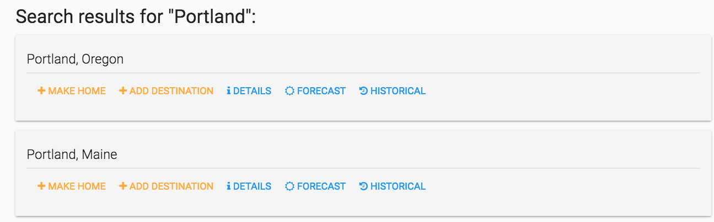
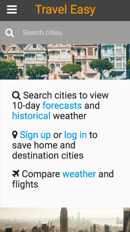

# Travel Easy

Check it out for yourself - [Travel Easy](https://travel-planner-project-2.herokuapp.com/)!

Travel Easy aims to simplify comparing weather and flights for multiple cities. View forecasts and historical weather data, and log in or sign up to save a home city and as many destinations as desired.

## Why?

While prospecting multiple cities for a winter getaway, I found myself collecting an overwhelming number of tabs to compare current and historical weather, and flight cost info.

Many sites and apps offer the ability to view weekly or 10-day forecasts for multiple cities, but none offered the ability to also compare historical averages over a period (what you might really want if looking for a vacation).

While I first tackled this challenge with a good ol' spreadsheet, it was laborious, and highly inconvenient.

Alas, Travel Easy to the rescue!

## User stories

* >As a user, I want to compare forecasts and historical weather for different cities so that I can plan where to vacation.

* >As a user, I want to have a log in and profile so I can save cities, travel dates, and add a profile picture.

* As a user, I want the site to be mobile friendly so that I can access all the features on my phone.

* As a user, I want to compare flight cost information so I can factor in travel costs (flight feature in progress).

## Key Technologies

* HTML, CSS, JavaScript
* Node: Express, bcrypt, Passport, Async, Express-EJS-Layouts
* PostgreSQL, Sequelize
* Materialize, Bootstrap
* APIs
  * [Weather Underground](https://www.wunderground.com/weather/api/)
  * [Freegeoip.net](https://freegeoip.net/)
  * [Cloudinary](http://cloudinary.com/documentation/admin_api)

## Challenges

### Automatically assigning default "home" location based on the user's IP.
Initially, I had default values entered when a user would sign up, but desired the ability to automatically assign them a city.  

To avoid relying on location permissions, I went to freegeoip.net to find lat/lon data using a user's IP. Once I had the API wired up, I realized each test user signing up was defaulting to somewhere in Kansas... of course, because I was hosting the API call on the server and using it's IP.  

So, I looked into implications of running on the client and found with API keys amongst other reasons, it wasn't the best solution.  Finally, I researched how to extract an IP from a request and was able to plug that into a server-side API call.  The call extracts lat/lon data then makes a subsequent call to the weather API to assign city and ZIP in desired format.

### Pulling both forecast and historical weather data for multiple cities at once (multiple, reliant API calls to different urls).
This was particularly challenging due to the timing and execution of functions on the server, and was handled primarily with Async's different callback-based functions.  

The Async "waterfall" function was helpful in passing data from one call to another while the "series" function also helped ensure sequencing of execution.  Lastly, the "concat" function helped improve code structure when passing over an array of urls for a given API call.

### Setting up models and associations for users and cities.
Key to Travel Easy's functionality is the ability for users to log in and save cities of interest.  

To make this happen, M:M relationships were built between a user and a city.  While 1:M could have been sufficient for this task, M:M allows for future features such as looking up all the users that have a certain city saved, thereby creating an additional level of community-type functionality.  

## In Progress

* Add Google Flights API and integrate user and airport models to allow users to find and save flight cost data (min, avg, high).
* Add Facebook authorization for sign up and log in.

## Contact  

Please feel free to reach out with any questions and/or comments!

* [Email](tlim24@gmail.com)
* [LinkedIn](https://www.linkedin.com/in/tommy-lim)

## Travel Easy in Action

### Profile Home [Screenshot]

### Search Results [Screenshot]

### Historical Weather [Screenshot]

### Mobile Friendly [Screenshot]

